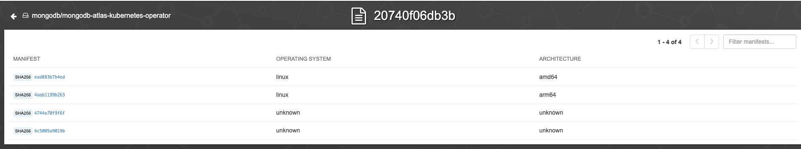

# Atlas Operator Release Instructions

For the various PRs involved, seek at least someone else to approve. In case of doubts, engage the team member(s) who might be able to clarify and seek their review as well.

## Prerequisites

To get PRs to be auto-committed for RedHat community & Openshift you need to make sure you are listed in the [team members ci.yaml list for community-operators](https://github.com/k8s-operatorhub/community-operators/blob/main/operators/mongodb-atlas-kubernetes/ci.yaml) and [team members ci.yaml list for community-operators-prod](https://github.com/redhat-openshift-ecosystem/community-operators-prod/blob/main/operators/mongodb-atlas-kubernetes/ci.yaml).

This is not required for [Certified Operators](https://github.com/redhat-openshift-ecosystem/certified-operators/blob/main/operators/mongodb-atlas-kubernetes/ci.yaml).

Finally, make sure you have a "RedHat Connect" account and are a [team member with org administrator role in the team list](https://connect.redhat.com/account/team-members).

### Tools

Most tools are automatically installed for you. Most of them are Go binaries and use `go install`. There are a few that might cause issues and you might want to pre-install manually:

- [envsubst](https://www.gnu.org/software/gettext/manual/html_node/envsubst-Invocation.html) for autogenerating the SDLC checklist. Install manually, else makefile automation will install it using `go install`.
- [Docker SBOM plugin](https://github.com/docker/sbom-cli-plugin/) for generating SBOM files. It is available as an experimental feature on Docker for Mac or can be installed manually by [following the official instructions](https://github.com/docker/sbom-cli-plugin/?tab=readme-ov-file#getting-started). Another option is a [helper install script](../../scripts/sudo-install-docker-sbom-plugin.sh). Note: the helper scripts executes command using `sudo` privileges.

## Before starting the Release

- Create a draft of the release notes in a Google Document and share with Product and the Docs team.
- Ensure as well that supporting documents for new features are in review.
- Wait for approval of the release notes and availability of the associated documents.

**DO NOT** start the release process until the release notes are approved and associated documentation is, at least, in review state. Always seek explicit approval by Product and/or Management.

The reason for this preparatory step is to avoid customers getting new or breaking changes before their supporting documentation.

## Create the release branch

Once the release notes and documentation are ready and got explicit approval to start the release:

- Use the GitHub UI to create the new "Create Release Branch" workflow.
- Specify the `version` to be released in the text box and the author or `authors` involved in the release.

The deployment scripts (K8s configs, OLM bundle) will be generated and PR will be created with new changes on behalf
of the `github-actions` bot.

Pass the version with the `X.Y.Z` eg. `1.2.3`, **without** the `v...` prefix.

See [Troubleshooting](#troubleshooting) in case of issues, such as [errors with the major version](#major-version-issues-when-create-release-branch).

Expect this branch to include the Software Security Development Lifecycle Policy Checklist (SSDLC) document at path `docs/releases/v${VERSION}/sdlc-compliance.md`. Note the SBOM files cannot be generated yet, as they require the image to have been published already.

## Approve the Pull Request named "Release x.y.z"

1. Review the Pull Request.
1. Approve and merge it to `main`.

At this point `main` represents what would become the next release, cut the release by doing:

```shell
$ git checkout -b main origin/main
$ git tag vX.Y.Z # where X.Y.Z represent the version to be released
$ git push origin vX.Y.Z
```

A new job "Create Release" will be triggered and the following will be done:
* Atlas Operator image is built and pushed to DockerHub
* Draft Release will be created with all commits since the previous release
* A subsequent job will be triggered to create a SBOMs update PR

### SSDLC SBOMs PR

A new PR should have been created titled `Add SBOMs for version ...`. Please review all is as expected and merge. It should contain just a couple of new files at directory `docs/releases/v${VERSION}/`:
- `linux-amd64.sbom.json`
- `linux-arm64.sbom.json`

## Manual SSDLC steps

### Process Overview

The SSDLC process requirements are as follows.

1. Sign our images with a MongoDB owned signature
1. Produce SBOM (Software Bill Of Materials) for each platform we support: `linux-amd64` & `linux-arm64`
1. Upload the plain SBOMs to a MongoDB internal Silk service instance.
1. Download the augmented SBOMS, including vulnerability metadata, from Silk.
1. Store both sets of SBOM files for internal reference.

The first two steps are semi-automated as documented here. The rest is fully manual.

Right now we are only using **one Silk asset group per platform**:
- `atlas-kubernetes-operator-linux-amd64`
- `atlas-kubernetes-operator-linux-arm64`

This means only the latest version is tracked by Silk. Note each upload will replace the SBOM document tracked on each asset group.

For more details about credentials required, to to `MongoDB Confluence` and look for page:
`Kubernetes Atlas Operator SSDLC Compliance Manual`

What follows is a quick reference of the make rules involved, assuming the credential setup is already completed and the process is already familiar.

### Upload SBOMs to Silk

```shell
make upload-sbom-to-silk SBOM_JSON_FILE="docs/releases/v${VERSION}/linux_amd64.sbom.json"
make upload-sbom-to-silk SBOM_JSON_FILE="docs/releases/v${VERSION}/linux_arm64.sbom.json"
```

### Download SBOMs from Silk

```shell
make download-from-silk TARGET_ARCH=arm64
make download-from-silk TARGET_ARCH=amd64
```

### Register SBOMs internally

```shell
make store-silk-sboms VERSION=${VERSION} TARGET_ARCH=amd64
make store-silk-sboms VERSION=${VERSION} TARGET_ARCH=arm64
```

## Edit the Release Notes and publish the release

Follow the format described in the [release-notes-template.md](../release-notes/release-notes-template.md) file. Paste the release notes content approved before the release was started. Once the image is out, publish the release notes draft as soon as possible.

## Synchronize configuration changes with the Helm Charts

Go to the [helm-chart repo](https://github.com/mongodb/helm-charts) and use GitHub Action [Create PR with Atlas Operator Release](https://github.com/mongodb/helm-charts/actions/workflows/post-atlas-operator-release.yaml). Run the workflow on branch `main` setting the version that is being release, eg. `1.9.0`.

The will update two Helm charts:
* [atlas-operator-crds](https://github.com/mongodb/helm-charts/tree/main/charts/atlas-operator-crds)
* [atlas-operator](https://github.com/mongodb/helm-charts/tree/main/charts/atlas-operator)
    
Merge the PR - the chart will get released automatically.

## Create Pull Requests to publish OLM bundles

All bundles/package manifests for Operators for operatorhub.io reside in the following repositories:
* https://github.com/k8s-operatorhub/community-operators - Kubernetes Operators that appear on [OperatorHub.io](https://operatorhub.io/)
* https://github.com/redhat-openshift-ecosystem/community-operators-prod - Kubernetes Operators that appear on [OpenShift](https://openshift.com/) and [OKD](https://www.okd.io/)
* https://github.com/redhat-openshift-ecosystem/certified-operators - Red Hat certified Kubernetes Operators

### Fork/Update the community operators repositories

**Note**: this has to be done once only. 

First ensure your SSH keys in [https://github.com/settings/keys] are authorized for `mongodb-forks` MongoDB SSO.

Execute the following steps:

1. Clone each of the above forked OLM repositories from https://github.com/mongodb-forks
2. Add `upstream` remotes
3. Export each cloned repository directory in environment variables

#### community-operators repository
```
git clone git@github.com:mongodb-forks/community-operators.git
git remote add upstream https://github.com/k8s-operatorhub/community-operators.git
export RH_COMMUNITY_OPERATORHUB_REPO_PATH=$PWD/community-operators
```
#### community-operators-prod repository
```
git clone git@github.com:mongodb-forks/community-operators-prod.git
git remote add upstream https://github.com/redhat-openshift-ecosystem/community-operators-prod.git
export RH_COMMUNITY_OPENSHIFT_REPO_PATH=$PWD/community-operators-prod
```
#### certified-operators repository
```
git clone git@github.com:mongodb-forks/certified-operators.git
git remote add upstream https://github.com/redhat-openshift-ecosystem/certified-operators
export RH_CERTIFIED_OPENSHIFT_REPO_PATH=$PWD/certified-operators
```

### Create a Pull Request for the `community-operators` repository

1. Ensure the `RH_COMMUNITY_OPERATORHUB_REPO_PATH` environment variable is set.
2. Invoke the following script with `<version>` set to `1.0.0` (don't use a `v` prefix):
```
./scripts/release-redhat.sh <version>
```

You can see an [example fixed PR here on Community Operators for version 1.9.1](https://github.com/k8s-operatorhub/community-operators/pull/3457).

Create the PR to the main repository and wait until CI jobs get green. 
After the PR is approved and merged - it will soon get available on https://operatorhub.io

### Create a Pull Request for the `community-operators-prod` repository

1. Ensure the `RH_COMMUNITY_OPENSHIFT_REPO_PATH` environment variable is set.
2. Invoke the following script with `<version>` set to `1.0.0` (don't use a `v` prefix):
```
./scripts/release-redhat-openshift.sh <version>
```

Submit the PR to the upstream repository and wait until CI jobs get green.

**Note**: It is required that the PR consists of only one commit - you may need to do
`git rebase -i HEAD~2; git push origin +mongodb-atlas-operator-community-<version>` if you need to squash multiple commits into one and perform force push)

After the PR is approved it will soon appear in the [Atlas Operator openshift cluster](https://console-openshift-console.apps.atlas.operator.mongokubernetes.com)

### Create a Pull Request for the `certified-operators` repository

This is necessary for the Operator to appear on "operators" tab in Openshift clusters in the "certified" section.

1. Ensure the `RH_CERTIFIED_OPENSHIFT_REPO_PATH` environment variable is set.
2. Set the image SHA environment variables of the **certified** images. 
To get the SHAs:

1. Go to https://connect.redhat.com/manage/components
2. search for "mongodb-atlas-kubernetes-operator"
3. select "[Quay] mongodb-atlas-kubernetes-operator"
4. filter for the given tag, i.e. "2.2.0"

The direct link, at the time of writing is https://connect.redhat.com/component/view/63568bb95612f26f8db42d7a/images.

Copy the **certified** image SHAs of the **amd64** and the **arm64** image:


> **NOTE**
> 
> In case you can't see the images tags in the https://connect.redhat.com go to the https://quay.io/repository/mongodb/mongodb-atlas-kubernetes-operator?tab=tags
and select the latest released tag that ends with `-certified` e.g. `2.4.0-certified`. Then click on `manifest` link for the selected image.
You should see two available manifests for `amd64` and `arm64` that you can use. Here is the example: https://quay.io/repository/mongodb/mongodb-atlas-kubernetes-operator/manifest/sha256:20740f06db3b6e768b40562ee50c729aba9870a9051045b4fc49d0c404cc18f6

```
export IMG_SHA_AMD64=sha256:c997f8ab49ed5680c258ee4a3e6a9e5bbd8d8d0eef26574345d4c78a4f728186
export IMG_SHA_ARM64=sha256:aa3ed7b73f8409dda9ac32375dfddb25ee52d7ea172e08a54ecd144d52fe44da
```


 - Use the version of the release as `VERSION`, remember the SEMVER x.y.z version without the `v`prefix.

```
export VERSION=<image-version>
```

Invoke the following script:
```
./scripts/release-redhat-certified.sh
```

Then go the GitHub and create a PR
from the `mongodb-fork` repository to https://github.com/redhat-openshift-ecosystem/certified-operators (`origin`).

Note: For some reason, the certified OpenShift metadata does not use the multi arch image reference at all, and only understand direct architecture image references.

You can see an [example fixed PR here for certified version 1.9.1](https://github.com/redhat-openshift-ecosystem/certified-operators/pull/3020).

After the PR is approved it will soon appear in the [Atlas Operator openshift cluster](https://console-openshift-console.apps.atlas.operator.mongokubernetes.com)

# Post install hook release

If changes have been made to the post install hook (mongodb-atlas-kubernetes/cmd/post-install/main.go).
You must also release this image. Run the "Release Post Install Hook" workflow manually specifying the desired 
release version.

# Post Release actions

Following the instructions above the release is completed, but the AKO repo is left using a `helm-charts/` submodule which is not pointing to the latest released Helm Chart. Make a PR to update that submodule:
```
cd helm-charts
git pull
```
Checkout to the branch for the release:
```
git checkout mongodb-atlas-kubernetes-<VERSION>
```
Return up to the AKO repo, and create a new branch & PR with the newer submodule:
```
cd ..
git checkout -b update-helm-submodule-<VERSION>
git add helm-charts
git push
```

If the release is a new minor version, then the CLI must be updated with the new version (and any new CRDs) [here](https://github.com/mongodb/mongodb-atlas-cli/blob/master/internal/kubernetes/operator/features/crds.go).

# Updating the ROSA cluster

For the Openshift upgrade tests we rely on a service account to be present in the OpenShift cluster and its login token to be present in CI.

## Setup Kubectl against the new cluster

1. Go to https://console.redhat.com/openshift
1. Use your RedHat account credentials to log in, see Pre-requisites on the RedHat Connect account you need to setup before this.
1. Form the list of Clusters, click of the name of the one to be used now.
1. CLick the `Open Console` in the top right of the page.
1. Use the cluster `htpasswd` credentials you should have been given beforehand to login to the cluster itself.
1. On the landing page, click the account drop down on the top right corner if the page and click on `Copy login command` there.
1. Login again with the `htpasswd`credentials.
1. On the white page click `Display token`.
1. Copy the `oc` command there and run it. You need to have [oc installed](https://docs.openshift.com/container-platform/4.8/cli_reference/openshift_cli/getting-started-cli.html) for this step to work.

After that if you do `kubectl config current-context` it should display you are connected to your new cluster.

## Create the cluster managing service account

Using the kubectl context against the new cluster, create the service account and its token:

```shell
$ kubectl create ns atlas-upgrade-test-tokens
$ kubectl -n atlas-upgrade-test-tokens create serviceaccount atlas-operator-upgrade-test
$ oc create token --duration=87600h -n atlas-upgrade-test-tokens atlas-operator-upgrade-test >token.txt
```

Give this service account enough permissions, currently this is cluster-admin:

```shell
$ oc adm policy add-cluster-role-to-user cluster-admin system:serviceaccount:atlas-upgrade-test-tokens:atlas-operator-upgrade-test
```

Copy & Paste token.txt into the `OPENSHIFT_UPGRADE_TOKEN` secret in Github Actions.

Run `kubectl cluster-info` Eg:

```shell
% kubectl cluster-info
Kubernetes control plane is running at https://***somehostname***.com:6443
...
```

And use the URL there to set `OPENSHIFT_UPGRADE_SERVER_API` so that openshift upgrade tests to run successfully.

## Troubleshooting

### Major version issues when executing the "Create Release Branch" workflow

The release creation will fail if the file `major-version` contents does not match the major version to be released. This file explicitly means the upcoming release is for a particular major version, with potential breaking changes. This allows us to:

1. Notice if we forgot to update the `major-version` file before releasing the next major version.
2. Notice if we tried to re-release an older major version when the code is already prepared for the next major version.
3. Skip some tests, like `helm update`, when crossing from one major version to the next, as such test is not expected to work across incompatible major version upgrades.

If the create release branch job fails due an error such as `Bad major version for X... expected Y..`, review whether or not the `major-version` file was updated as expected. Check as well you are not trying to release a patch for the older major version from the new major version codebase.