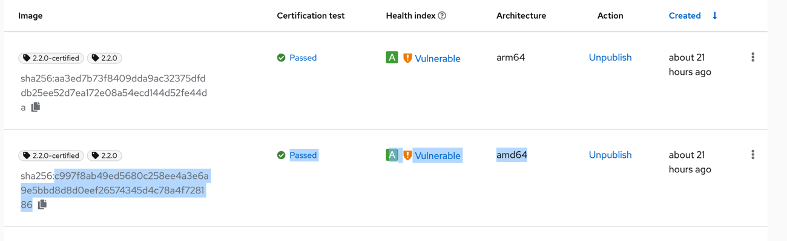

# Atlas Operator Release Instructions

## Create the release branch

Use the GitHub UI to create the new "Release Branch" workflow. Specify the version to be released in the text box.
The deployment scripts (K8s configs, OLM bundle) will be generated and PR will be created with new changes on behalf
of the `github-actions` bot.

NOTE: The X- and Y- stream releases should only be launched using the workflow from the MAIN branch. Z-stream (patch)
releases can be launched from a separate branch

The release creation will fail if the file `major-version` contents does not match the major version to be released. This file explicitly means the upcoming release is for a particular major version, with potential breaking changes. This allows us to:

1. Notice if we forgot to update the `major-version` file before releasing the next major version.
2. Notice if we tried to re-release an older major version when the code is already prepared for the next major version.
3. Skip some tests, like `helm update`, when crossing from one major version to the next, as such test is not expected to work across incompatible major version upgrades.

If the create release branch job fails due an error such as `Bad major version for X... expected Y..`, review whether or not the `major-version` file was updated as expected. Check as well you are not trying to release a patch for the older major version from the new major version codebase.

## Approve the Pull Request named "Release x.y.z"

Review the Pull Request. Approve and merge it to main.
The new job "Create Release" will be triggered and the following will be done:
* Atlas Operator image built and pushed to dockerhub
* Draft Release will be created with all commits since the previous release

## Edit the Release Notes and publish the release

Follow the format described in the release-notes-template.md file. Publish the release.

## Synchronize configuration changes with the Helm Charts

Go to the [helm-chart repo](https://github.com/mongodb/helm-charts) and use GitHub Action [Create PR with Atlas Operator Release](https://github.com/mongodb/helm-charts/actions/workflows/post-atlas-operator-release.yaml). Run the workflow on branch `main` setting the version that is being release, eg. `1.9.0`.

The will update two Helm charts:
* [atlas-operator-crds](https://github.com/mongodb/helm-charts/tree/main/charts/atlas-operator-crds)
* [atlas-operator](https://github.com/mongodb/helm-charts/tree/main/charts/atlas-operator)
    
Merge the PR - the chart will get released automatically.

## Create the Pull Request to publish the bundle to operatorhub.io

All bundles/package manifests for Operators for operatorhub.io reside in:
* `https://github.com/k8s-operatorhub/community-operators` - for public Operators from operatorhub.io
* `https://github.com/redhat-openshift-ecosystem/community-operators-prod` - for Operators from "internal" operatorhub that are synchronized with Openshift clusters

### Fork/Update the community operators repositories

**(First time only) Fork 2 separate repositories**

#### 1. OperatorHub

Clone, if not done before, the MongoDB fork of [the community operators repo](https://github.com/k8s-operatorhub/community-operators):

```bash
git clone git@github.com:mongodb-forks/community-operators.git
```

Add the upstream repository as a remote one:

```bash
git remote add upstream https://github.com/k8s-operatorhub/community-operators.git
```

Assign the repo path to `RH_COMMUNITY_OPERATORHUB_REPO_PATH` env variable.

#### 2. Openshift

Clone, if not done before, the MongoDB fork of [the OpenShift Community Operators repo](https://github.com/redhat-openshift-ecosystem/community-operators-prod):

```bash
git clone git@github.com:mongodb-forks/community-operators-prod.git
```

Add the upstream repository as a remote one:

```bash
git remote add upstream https://github.com/redhat-openshift-ecosystem/community-operators-prod.git
```

Assign the repo path to `RH_COMMUNITY_OPENSHIFT_REPO_PATH` env variable.

#### 3. OpenShift Certified

Clone, if not done before, the MongoDB fork of [the Red Hat certified operators production catalog repo](https://github.com/redhat-openshift-ecosystem/certified-operators):

```bash
git clone git@github.com:mongodb-forks/certified-operators.git
```

Add the upstream repository as a remote one:

```bash
git remote add upstream https://github.com/redhat-openshift-ecosystem/certified-operators
```

Assign the repo path to `RH_CERTIFIED_OPENSHIFT_REPO_PATH` env variable.

### Create a Pull Request for `operatorhub` with a new bundle

This is necessary for the Operator to appear on [operatorhub.io] site.
This step should be done after the previous PR is approved and merged.

Ensure you have the `RH_COMMUNITY_OPERATORHUB_REPO_PATH` environment variable exported in `~/.bashrc` or `~/.zshrc`
pointing to the directory where `operatorhub-operator` repository was cloned in the previous step.

For this PR the sources are copied from the `community-operators` folder instead of the one where the `mongodb-atlas-kubernetes` resides.

Invoke with <version> like `1.0.0` (never use the `v` prefix here, just the plain SEMVER version `x.y.z`):

```
./scripts/release-redhat.sh <version>
```

Before posting the PR there is a manual change you need to make:

* Ensure to add the `quay.io/` prefix in all Operator image references.

You can see an [example fixed PR here on Community Operators for version 1.9.1](https://github.com/k8s-operatorhub/community-operators/pull/3457).

Create the PR to the main repository and wait until CI jobs get green. 
After the PR is approved and merged - it will soon get available on https://operatorhub.io

### Create a Pull Request for `openshift` with a new bundle

This is necessary for the Operator to appear on "operators" tab in Openshift clusters

Ensure you have the `RH_COMMUNITY_OPERATORHUB_REPO_PATH` environment variable exported in `~/.bashrc` or `~/.zshrc`
pointing to the directory where `community-operators-prod` repository was cloned in the previous step.

Invoke the following script with <version> like `1.0.0` (no `v` prefix):
```
./scripts/release-redhat-openshift.sh <version>
```

Before posting the PR there is a manual change you need to make:

* Ensure to add the `quay.io/` prefix in all Operator image references.

You can see an [example fixed PR here on OpenShift for version 1.9.1](https://github.com/redhat-openshift-ecosystem/community-operators-prod/pull/3521).

Create the PR to the main repository and wait until CI jobs get green.

(note, that it's required that the PR consists of only one commit - you may need to do
`git rebase -i HEAD~2; git push origin +mongodb-atlas-operator-community-<version>` if you need to squash multiple commits into one and perform force push)

After the PR is approved it will soon appear in the [Atlas Operator openshift cluster](https://console-openshift-console.apps.atlas.operator.mongokubernetes.com)

### Create a Pull Request for `openshift-certified-operators` with a new bundle

This is necessary for the Operator to appear on "operators" tab in Openshift clusters in the "certified" section.

**Prerequisites**:
 - Ensure you have the `RH_CERTIFIED_OPENSHIFT_REPO_PATH` environment variable set pointing to the directory where `certified-operators` repository: https://github.com/redhat-openshift-ecosystem/certified-operators.
 - Set the image SHA environment variables of the **certified** images. To get the SHAs, go to https://connect.redhat.com/projects/63568bb95612f26f8db42d7a/images and copy the **certified** image SHAs of the **amd64** and the **arm64** image:



```
export IMG_SHA_AMD64=sha256:c997f8ab49ed5680c258ee4a3e6a9e5bbd8d8d0eef26574345d4c78a4f728186
export IMG_SHA_ARM64=sha256:aa3ed7b73f8409dda9ac32375dfddb25ee52d7ea172e08a54ecd144d52fe44da
```

 - Use the version of the release as `VERSION`, remember the SEMVER x.y.z version without the `v`prefix.

```
export VERSION=<image-version>
```

Invoke the following script:
```
./scripts/release-redhat-certified.sh
```

Then go the GitHub and create a PR
from the `mongodb-fork` repository to https://github.com/redhat-openshift-ecosystem/certified-operators (`origin`).

Note: For some reason, the certified OpenShift metadata does not use the multi arch image reference at all, and only understand direct architecture image references.

You can see an [example fixed PR here for certified version 1.9.1](https://github.com/redhat-openshift-ecosystem/certified-operators/pull/3020).

After the PR is approved it will soon appear in the [Atlas Operator openshift cluster](https://console-openshift-console.apps.atlas.operator.mongokubernetes.com)

# Post install hook release

If changes have been made to the post install hook (mongodb-atlas-kubernetes/cmd/post-install/main.go).
You must also release this image. Run the "Release Post Install Hook" workflow manually specifying the desired 
release version. 

# Post Release actions

Following the instructions above the release is completed, but the AKO repo is left using a `helm-charts/` submodule which is not pointing to the latest released Helm Chart. Make a PR to update that submodule.
