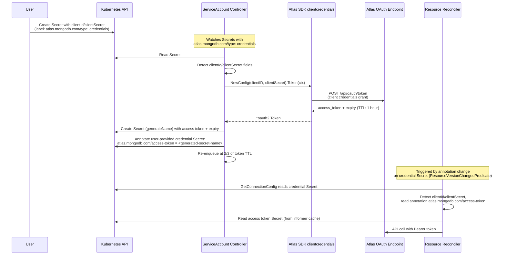

# Service Account Authentication Support

## Overview

Atlas is moving from legacy API keys (HTTP Digest) to service accounts (OAuth 2.0 Client Credentials).
See https://www.mongodb.com/docs/atlas/api/api-authentication/#service-accounts-overview.

This document describes how the operator will support service account authentication
by extending the existing connection secret mechanism and introducing a dedicated
service-account controller for access token lifecycle management.

## Goals

- Support service account credentials (`clientId` / `clientSecret`) alongside existing API keys (`publicApiKey` / `privateApiKey`).
- Minimize changes to existing reconcilers — they should not need to know the details of token acquisition.
- Avoid creating a new access token on every reconcile loop (token churn). The operator runs
  many controllers reconciling potentially hundreds of resources, each calling `SdkClientSet`
  per reconcile. If every call triggered a fresh `POST /api/oauth/token`, it would generate
  thousands of token requests per hour, overloading the Atlas OAuth endpoint and risking
  rate limiting (`HTTP 429`). Instead, a single access token is obtained and shared across
  all reconcilers via a Kubernetes Secret, refreshed proactively by one dedicated controller.
- Reuse the existing connection secret contract and controller-runtime watch infrastructure.

## Non-Goals

- Migrating existing users from API keys to service accounts.
- Supporting both credential types in the same secret simultaneously.

## Architecture



## User-Facing Contract

The user creates a connection secret with the following shape:

```yaml
apiVersion: v1
kind: Secret
metadata:
  name: my-atlas-credentials
  namespace: atlas
  labels:
    atlas.mongodb.com/type: credentials
type: Opaque
stringData:
  orgId: "64abc123def456"
  clientId: "my-service-account-client-id"
  clientSecret: "my-service-account-client-secret"
```

This is the same secret shape as today, but with `clientId` and `clientSecret`
instead of `publicApiKey` and `privateApiKey`. The `orgId` field remains required.

The user references this secret from their Atlas custom resources exactly as they
do today (via `connectionSecret` or the global secret).

## Component 1: Service-Account Controller

A new controller that reconciles Secrets labeled `atlas.mongodb.com/type: credentials`.

The controller receives the configured Atlas domain at construction time (the `--atlas-domain`
flag value, same as other controllers receive the `AtlasProvider`). This is required because
`clientcredentials.NewConfig` from the Atlas SDK hardcodes the token URL to
`https://cloud.mongodb.com/api/oauth/token`. The controller must override it to support
QA (`cloud-qa.mongodb.com`) and Gov (`cloud.mongodbgov.com`) environments:

```go
cfg := clientcredentials.NewConfig(clientID, clientSecret)
cfg.TokenURL = atlasDomain + clientcredentials.TokenAPIPath
```

This is the same pattern used internally by the SDK's `UseOAuthAuth` in
`admin/atlas_client.go` (lines 72-76).

### Reconcile Logic

1. Read the Secret.
2. If the Secret does not contain `clientId` and `clientSecret` fields, skip (this is an API key secret, not our concern).
3. If the annotation `atlas.mongodb.com/access-token` already exists, read the referenced access token Secret:
    - If it exists and the token is not yet at 2/3 of its TTL, re-enqueue at 2/3 of remaining TTL. Done.
    - If it exists but the token needs refresh, use the Atlas SDK's
      `clientcredentials.NewConfig(clientID, clientSecret)` from
      `go.mongodb.org/atlas-sdk/v20250312013/auth/clientcredentials` with `TokenURL`
      overridden to the configured Atlas domain (see above). Call `.Token(ctx)` to obtain
      a new token, **update the existing access token Secret in place**, and re-enqueue
      at 2/3 of the new TTL. Done.
4. If the annotation does not exist (first time):
    - Use the Atlas SDK's `clientcredentials.NewConfig(clientID, clientSecret)` from
      `go.mongodb.org/atlas-sdk/v20250312013/auth/clientcredentials` with `TokenURL`
      overridden to the configured Atlas domain (see above). Call `.Token(ctx)` which
      returns an `*oauth2.Token` containing `AccessToken` and `Expiry`. This handles
      the `POST /api/oauth/token` request, auth style, and error handling without
      manual HTTP calls.
    - Create a new Secret using `generateName` (e.g., `<credential-secret-name>-token-`) containing the access token and its expiry timestamp.
    - Set an `ownerReference` on the generated Secret pointing to the credential Secret (for automatic garbage collection on deletion).
    - Annotate the user-provided credential Secret (the one containing `clientId`/`clientSecret`) with `atlas.mongodb.com/access-token: <generated-secret-name>`.
    - Re-enqueue at 2/3 of the token TTL.

### Access Token Secret Shape

```yaml
apiVersion: v1
kind: Secret
metadata:
  generateName: my-atlas-credentials-token-
  name: my-atlas-credentials-token-x7g2k  # generated by Kubernetes API server
  namespace: atlas
  ownerReferences:
    - apiVersion: v1
      kind: Secret
      name: my-atlas-credentials
      uid: <uid>
type: Opaque
data:
  accessToken: <base64-encoded-bearer-token>
  expiry: <base64-encoded-RFC3339-timestamp>
```

### Token Refresh Strategy

- Access tokens are valid for 1 hour (3600 seconds).
- The controller re-enqueues at 2/3 of the TTL (~40 minutes) to refresh proactively.
- On refresh, the controller updates the existing access token Secret's `data` in place (no new Secret created).
- The `generateName` path only executes once, on first token creation.

### Watch Configuration

The controller-runtime cache is already globally configured in `internal/operator/builder.go`
(lines 196-203) to only cache Secrets with the label `atlas.mongodb.com/type: credentials`:

```go
cacheOpts.ByObject = map[client.Object]cache.ByObject{
    &corev1.Secret{}: {
        Label: labels.SelectorFromSet(labels.Set{
            secretservice.TypeLabelKey: secretservice.CredLabelVal,
        }),
    },
}
```

This means:

1. The service-account controller does not need its own label-filtering predicate.
   A simple `For(&corev1.Secret{})` is sufficient — the cache already only contains
   credential-labeled Secrets.

2. **Important**: The generated access token Secret must also carry the
   `atlas.mongodb.com/type: credentials` label, otherwise it will not be in the
   informer cache and `GetConnectionConfig` will not be able to read it via the
   cached client. Alternatively, the access token Secret could be read via a direct
   API server call (uncached client), but using the label is simpler and consistent.

3. Existing resource reconcilers (AtlasProject, AtlasDeployment, AtlasDatabaseUser, etc.)
   already watch `&corev1.Secret{}` with `ResourceVersionChangedPredicate` and map functions
   that find which custom resources to re-reconcile when a Secret changes. When the
   service-account controller annotates the user-provided credential Secret, the
   `ResourceVersion` changes and all reconcilers referencing that Secret are automatically
   re-triggered. No changes to existing watch configurations are needed.

## Component 2: Changes to GetConnectionConfig

`internal/controller/reconciler/credentials.go` — the `GetConnectionConfig` function.

### Current Behavior

Reads `orgId`, `publicApiKey`, `privateApiKey` from the Secret and returns a `ConnectionConfig` with `Credentials.APIKeys`.

### New Behavior

After reading the Secret, detect which credential type is present:

1. If `publicApiKey` and `privateApiKey` are present: existing API key path (unchanged).
2. If `clientId` and `clientSecret` are present: service account path:
    - Read the annotation `atlas.mongodb.com/access-token` from the Secret.
    - If the annotation is missing, return an error. The caller (reconciler) will `Terminate` and re-enqueue at `DefaultRetry` (10 seconds), which is the existing error handling behavior. No special 15-second logic needed.
    - If the annotation is present, read the referenced access token Secret via the k8s client (served from the informer cache).
    - Return a `ConnectionConfig` with `Credentials.BearerToken` populated.
3. If neither credential type is present: return a validation error (existing behavior).

### Why Re-Enqueue Works Without Special Handling

When the annotation is missing, `GetConnectionConfig` returns an error. The reconciler calls `Terminate(workflow.AtlasAPIAccessNotConfigured, err)` which re-enqueues at `DefaultRetry` (10 seconds). Meanwhile, the service-account controller will create the token and annotate the Secret. The annotation change triggers the reconciler again via the existing `ResourceVersionChangedPredicate` watch on Secrets. Whichever fires first (the watch event or the retry timer) will find the annotation present and proceed.

If the access token expires mid-reconcile (unlikely given the 40-minute refresh), the Atlas API call will fail with a 401, the reconciler will error out and re-enqueue as usual. By then the service-account controller will have already refreshed the token.

## Component 3: Changes to Credentials and SdkClientSet

`internal/controller/atlas/provider.go`

### Credentials Type Extension

```go
type Credentials struct {
    APIKeys        *APIKeys
    ServiceAccount *ServiceAccountToken
}

type ServiceAccountToken struct {
    BearerToken string
}
```

### SdkClientSet Branching

```go
func (p *ProductionProvider) SdkClientSet(ctx context.Context, creds *Credentials, log *zap.SugaredLogger) (*ClientSet, error) {
    var httpClient *http.Client

    switch {
    case creds.ServiceAccount != nil:
        httpClient = bearerTokenHTTPClient(creds.ServiceAccount.BearerToken)
    case creds.APIKeys != nil:
        httpClient = digestHTTPClient(creds.APIKeys.PublicKey, creds.APIKeys.PrivateKey)
    default:
        return nil, errors.New("no credentials provided")
    }

    // ... wrap with logging, dryrun, etc. and create SDK client with UseHTTPClient(httpClient)
}
```

The bearer token HTTP client adds an `Authorization: Bearer <token>` header to every request.
This is a simple `RoundTripper` wrapper — no need for the SDK's `UseOAuthAuth` since we already
have the token.

## Validation

`validate()` in `credentials.go` is updated to accept either credential type:

- `orgId` is always required.
- Either (`publicApiKey` AND `privateApiKey`) OR (`clientId` AND `clientSecret`) must be present.
- Both present simultaneously is an error.

## What Does NOT Change

- No changes to CRDs or the API surface.
- No changes to how reconcilers reference connection secrets.
- No changes to the Secret watch predicates on existing controllers (they already watch Secrets via `ResourceVersionChangedPredicate`).
- The generated controllers under `internal/generated/controller/` call `GetConnectionConfig` the same way — they benefit automatically.

## Edge Cases

| Scenario                                                        | Behavior                                                                                                                                                         |
|-----------------------------------------------------------------|------------------------------------------------------------------------------------------------------------------------------------------------------------------|
| Credential Secret deleted                                       | ownerReference causes access token Secret to be garbage collected                                                                                                |
| Token refresh fails (Atlas unreachable)                         | Service-account controller errors, re-enqueues with backoff. Reconcilers continue using the existing (possibly stale) token until it expires.                    |
| Token expires mid-reconcile                                     | Atlas returns 401, reconciler terminates and re-enqueues. By then the token should be refreshed.                                                                 |
| Annotation points to a deleted Secret                           | GetConnectionConfig returns error, reconciler re-enqueues. Service-account controller will detect the missing Secret on its next reconcile and create a new one. |
| Secret has both API keys and service account fields             | Validation error — reject as ambiguous.                                                                                                                          |
| Service-account controller not running (e.g., feature disabled) | Annotation never appears, reconcilers keep re-enqueuing with errors. Clear error message in conditions.                                                          |

## File Change Summary

| File                                            | Change                                                                                                   |
|-------------------------------------------------|----------------------------------------------------------------------------------------------------------|
| `internal/controller/atlas/provider.go`         | Add `ServiceAccountToken` type, branch `SdkClientSet` for bearer auth                                    |
| `internal/controller/reconciler/credentials.go` | Detect `clientId`/`clientSecret`, read annotation and token Secret, update `validate()`                  |
| `internal/controller/serviceaccount/` (new)     | New service-account controller package with RBAC markers for Secret `get;list;watch;create;update;patch` |
| `internal/controller/registry.go`               | Register the new service-account controller in `registerControllers()`                                   |
| `internal/mocks/atlas/provider.go`              | No structural change (mock already delegates via func field)                                             |
| `config/rbac/`                                  | Regenerated by `make manifests` to include new RBAC rules from the controller's kubebuilder markers      |
| Unit tests                                      | New tests for both credential paths, token refresh logic, validation                                     |
