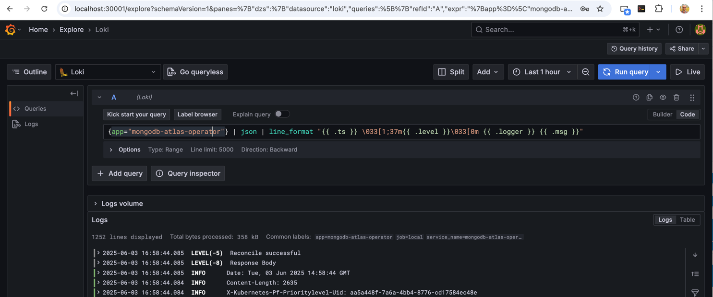
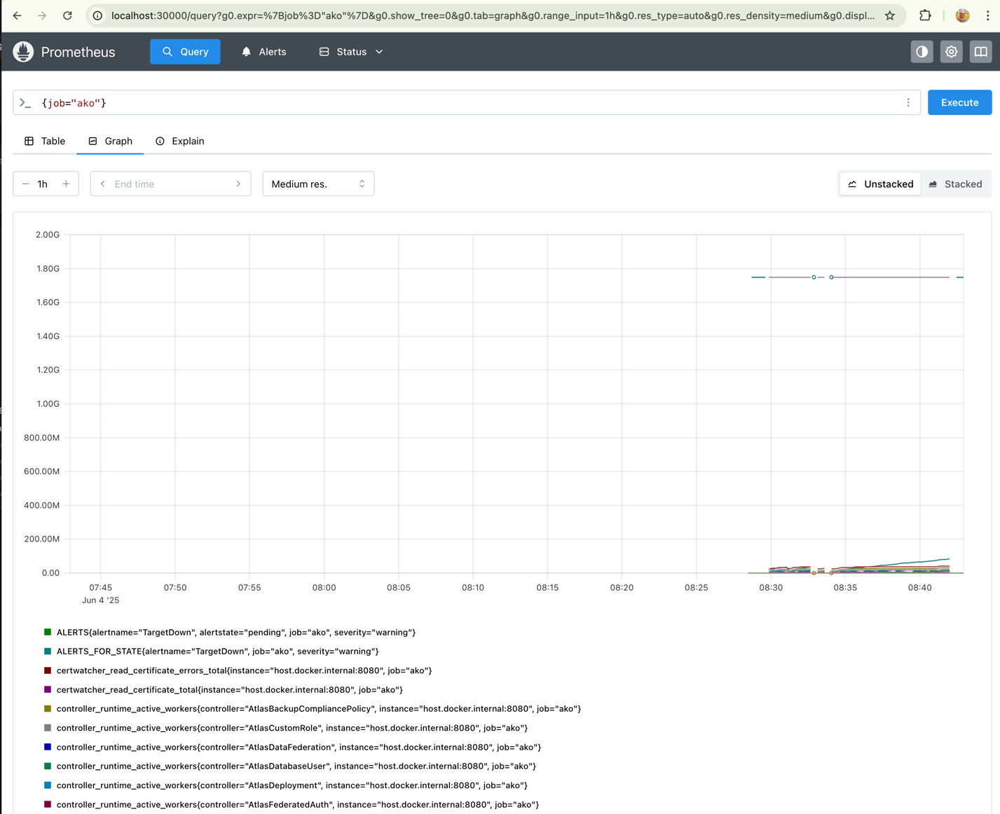
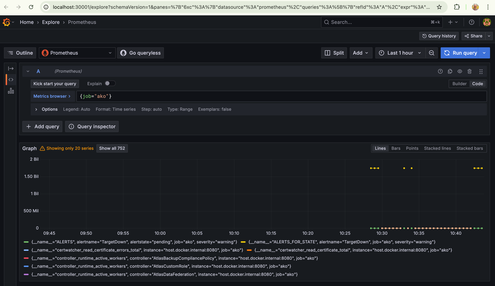

# Developer Observability Stack

Welcome to DOS, the Developer Observability Stack! This guide will help you set up and use the observability stack for monitoring and logging your local applications.

### Prerequisites

You need to have the following tools installed on your machine:
- kind
- docker
- kubectl

### Building

```bash
go build -o dos test/helper/observability/cmd/dos/main.go
```

### Installation
Run the following command to install the observability stack:
```bash
./dos install
```

Every executed command will be displayed in the terminal, so you can see what is happening under the hood.x
Once the installation is complete, you will see a message indicating that the observability stack has been successfully installed:
```shell
$ ./dos install
...
[kubectl -n loki rollout status --watch statefulset/loki]
Waiting for 1 pods to be ready...
partitioned roll out complete: 1 new pods have been updated...

[kubectl -n promtail rollout status --watch deployment/promtail]
deployment "promtail" successfully rolled out

[kubectl -n monitoring rollout status --watch deployment/kube-prometheus-kube-state-metrics]
deployment "kube-prometheus-kube-state-metrics" successfully rolled out

[kubectl -n monitoring rollout status --watch statefulset/prometheus-kube-prometheus-kube-prome-prometheus]
statefulset rolling update complete 1 pods at revision prometheus-kube-prometheus-kube-prome-prometheus-7878868748...
```

**Note**: the initialisation of the loki statufulset may take a while, so please be patient.

### Observing

Run the following command to start observing your application:
```bash
./dos observe <command>
```

Example:
```bash
./dos observe make run
```

**Note**: each line of the output will be prefixed with a timestamp, log level, logger name, and message unless it is already a JSON structure.

### Loki

1. Open http://localhost:30001/explore in your browser.
2. Use the user "admin" and password "prom-operator to log in.
3. Enter the following query to see logs from the MongoDB Atlas Operator:

```loki
{job="ako"} | json | line_format "{{ .ts }} \033[1;37m{{ .level }}\033[0m \033[1;32m{{ .logger }}\033[0m {{ .msg }}"
```
Or try this link directly in [Grafana (http://localhost:30001/...)](http://localhost:30001/explore?schemaVersion=1&panes=%7B%225c9%22:%7B%22datasource%22:%22loki%22,%22queries%22:%5B%7B%22refId%22:%22A%22,%22expr%22:%22%7Bjob%3D%5C%22ako%5C%22%7D%20%7C%20json%20%7C%20line_format%20%5C%22%7B%7B%20.ts%20%7D%7D%20%5C%5C033%5B1;37m%7B%7B%20.level%20%7D%7D%5C%5C033%5B0m%20%5C%5C033%5B1;32m%7B%7B%20.logger%20%7D%7D%5C%5C033%5B0m%20%7B%7B%20.msg%20%7D%7D%5C%22%22,%22queryType%22:%22range%22,%22datasource%22:%7B%22type%22:%22loki%22,%22uid%22:%22loki%22%7D,%22editorMode%22:%22code%22,%22direction%22:%22backward%22%7D%5D,%22range%22:%7B%22from%22:%22now-1h%22,%22to%22:%22now%22%7D%7D%7D&orgId=1)



### Prometheus

Metrics are being scraped automatically from the docker/kind host (the developer) from the `:8080/metrics` endpoint.
Whatever is being started, this endpoint will be scraped an all metrics will have the label `job="ako"` attached.

You can execute the following basic query to see all metrics scraped from the host:
```prometheus
{job="ako"}
```

Try this link directly in [Prometheus (http://localhost:30000/...)](http://localhost:30000/query?g0.expr=%7Bjob%3D%22ako%22%7D&g0.show_tree=0&g0.tab=table&g0.range_input=1h&g0.res_type=auto&g0.res_density=medium&g0.display_mode=lines&g0.show_exemplars=0)



or

Try this link directly in [Grafana (http://localhost:30001/...)](http://localhost:30001/explore?schemaVersion=1&panes=%7B%226xc%22:%7B%22datasource%22:%22prometheus%22,%22queries%22:%5B%7B%22refId%22:%22A%22,%22expr%22:%22%7Bjob%3D%5C%22ako%5C%22%7D%22,%22range%22:true,%22datasource%22:%7B%22type%22:%22prometheus%22,%22uid%22:%22prometheus%22%7D,%22editorMode%22:%22code%22,%22legendFormat%22:%22__auto%22%7D%5D,%22range%22:%7B%22from%22:%22now-1h%22,%22to%22:%22now%22%7D%7D%7D&orgId=1)

